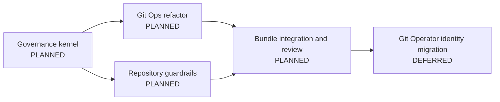

# Git Operator

Git Operator helps an already capable agent recognize the repository decisions
where generic Git knowledge is insufficient: existing work, concurrent sessions,
file ownership, history ownership, collaboration state, repository policy, and
irreversible effects.

It uses a cheap universal entry point and earns deeper inspection only when the
request or observed state exposes ambiguity or risk. Routine safe operations
continue through `git-ops` without a heavyweight governance ceremony.

## Product outcomes

- Select or resume the correct workstream before creating competing work.
- Check existing paths and overlapping changes before writing or isolating work.
- Choose branch and worktree boundaries independently.
- Classify history ownership before rewriting or publishing it.
- Route Git and GitHub operations through proportional safety checks.
- Audit, propose, and apply repository guardrails with explicit authority.
- Preserve continuity in Git, issues, PRs, worktrees, and adopted project records
  instead of duplicating their state.

## Non-goals

- Teach basic Git commands or restate knowledge models already possess.
- Wrap every Git invocation in another command or verbose report.
- Replace judgment with a universal branching, commit, or PR policy.
- Infer that a branch is isolated merely because it has a tidy purpose or name.
- Create persistent coordination records unless the repository adopts them.

## Failure model

Git Operator exists because command knowledge does not reliably answer what an
agent should touch, where work belongs, who else depends on it, or which policy
governs it. It targets recurring repository mistakes such as:

- overwriting an existing file without inspecting its content or ownership;
- starting on `main` or in an occupied checkout without choosing a review and
  concurrency boundary;
- creating a tidy new branch whose changed files overlap an active workstream;
- switching, stashing, resetting, or removing a worktree while it holds work;
- rebasing or force-pushing history whose consumers were never established;
- applying generic Git, commit, PR, or release advice against local policy;
- publishing secrets, identity leaks, version drift, or unverified artifacts;
- treating a structurally successful command as proof of the intended outcome.

The system cannot prove that an unreported external session exists. It must use
observable worktrees, changed files, branches, remotes, PRs, project records, and
owner statements; uncertainty remains explicit instead of becoming false safety.

## Advantage over generic model knowledge

A capable model already knows Git syntax and common workflows. Git Operator adds
repository-local evidence, consistent decision timing, deterministic checks, and
explicit authority boundaries. The intended difference is:

```text
generic behavior: request -> plausible command -> execution
operator behavior: request -> decision-changing evidence -> safe boundary
                   -> focused execution -> verified outcome
```

The bundle does not replace native model reasoning. It makes high-value checks
recur at the moment they matter and progressively discloses only the specialist
procedure needed for the chosen route.

## Active Campaign



The campaign exits when the universal governance entry point, focused executor,
and guardrail modes work as one reviewed bundle without regressing existing
distribution contracts. Public renaming is a later decision earned by that proof.
